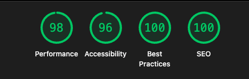

# Enoca Frontend Challenge

Bu proje, Enoca Frontend Challenge gereksinimlerini karşılamak amacıyla hazırlanmış bir landing sayfası ve UI bileşen kütüphanesi çalışmasıdır.

Proje, PDF belgesinde belirtilen tüm ana gereksinimleri karşılamaktadır:
* Tek sayfalık, 5 bölümlü bir landing sayfası (Hero, Özellikler, Fiyatlar, SSS, İletişim)[cite: 4].
* Yeniden kullanılabilir 5 UI bileşeni (Button, Input, Card, Modal, Accordion)[cite: 5].
* Mobil-öncelikli (Mobile-First) responsive tasarım[cite: 6].
* Light/Dark tema desteği (CSS Değişkenleri ile)[cite: 7].
* Yalın JS (React State) ile basit form doğrulaması[cite: 8].


## 🚀 Canlı Demo

Projenin Netlify üzerinden deploy edilmiş canlı versiyonuna buradan ulaşabilirsiniz:

**[Netlify Link](https://enoca-frontend-challange.netlify.app/)**

---

## 🛠️ Kullanılan Teknolojiler

* **Build Aracı:** Vite
* **Framework:** React
* **Stil:** SCSS (BEM metodolojisi ile)
* **Versiyon Kontrol:** Git & GitHub (Conventional Commits & PR Akışı)
* **Erişilebilirlik & SEO:** Semantik HTML, ARIA, Meta Etiketleri

---

## 📦 Kurulum ve Çalıştırma

1.  Depoyu yerel makinenize klonlayın:
    ```bash
    git clone https://github.com/alpayozer/enoca-frontend-challenge.git
    cd enoca-frontend-challenge
    ```

2.  Gerekli NPM paketlerini yükleyin:
    ```bash
    npm install
    ```

3.  Projeyi geliştirme modunda (development) çalıştırın:
    ```bash
    npm run dev
    ```

4.  Üretim (production) build'i almak için:
    ```bash
    npm run build
    ```

---

## 🏛️ Kısa Mimari Notlar

* **Bileşen (Component) Yapısı:**
    * Tüm yeniden kullanılabilir, saf UI elemanları (Button, Input, Card, Modal, Accordion) `src/components` klasörü altında geliştirilmiştir. Bu bileşenler "props" aracılığıyla yapılandırılabilir durumdadır.
    * Landing sayfasının ana bölümleri (Hero, Features, Pricing vb.) `src/sections` klasörü altında, `components` klasöründeki bileşenleri kullanarak "akıllı" bileşenler olarak oluşturulmuştur.

* **Stil (SCSS):**
    * Gereksinimlerde belirtildiği gibi **SCSS zorunluluğuna** uyulmuştur.
    * `src/styles/_theme.scss` dosyası, CSS Değişkenlerini kullanarak Light/Dark tema renk paletini yönetir.
    * Bileşen stilleri, BEM metodolojisine uygun olarak kendi `.scss` dosyalarında (component-scoped) tutulmuştur.

* **Duyarlı Tasarım (Responsive):**
    * **Mobil-öncelikli (Mobile-First)** yaklaşım benimsenmiştir.
    * Gereksinimlerde belirtilen 3 breakpoint (≤640, 641-1024, ≥1025) için `media query`'ler kullanılmıştır.

* **Versiyon Kontrol:**
    * `main` dalı korumalı olarak ayarlanmıştır.
    * Tüm geliştirmeler `dev` dalı üzerinden yürütülmüştür.
    * Özellikler `feat/*`, düzeltmeler ise `fix/*` dallarında geliştirilip, Conventional Commits formatına uygun olarak PR (Pull Request) ile `dev` dalına birleştirilmiştir.

---

## 📝 Karar Kayıtları (ADR)

* **ADR-001 (Framework Seçimi):**
    * **Karar:** `Vite + React` seçildi.
    * **Gerekçe:** PDF'te sunulan seçenekler (Vanilla TS, React, Angular) arasından React, "yeniden kullanılabilir UI bileşenleri" oluşturma hedefi için en uygun, modern ve esnek ekosistemi sunmaktadır.

* **ADR-002 (Stil Metodolojisi):**
    * **Karar:** BEM ile birlikte bileşen-bazlı SCSS.
    * **Gerekçe:** PDF'te BEM veya CSS Modules/SCSS önerilmişti. BEM, hızlı geliştirme, net bir isimlendirme standardı ve SCSS'in iç içe (nesting) özellikleriyle birleştiğinde yüksek okunabilirlik sağlaması nedeniyle tercih edildi.

---

## 📊 Lighthouse Raporu

Proje teslimatları arasında istenen Lighthouse raporu ekran görüntüsü ve performans hedefine ulaşıldığını gösteren sonuç aşağıdadır.

Gerekli tüm SEO (meta, robots.txt) ve performans (fetchpriority, kontrast) iyileştirmeleri yapılmıştır.

